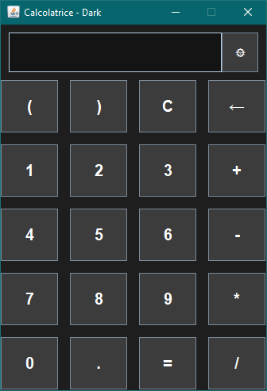
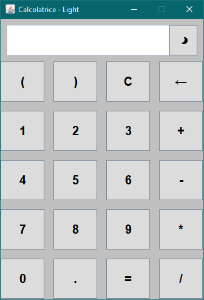
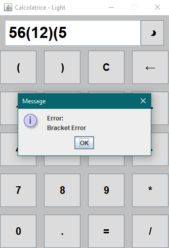
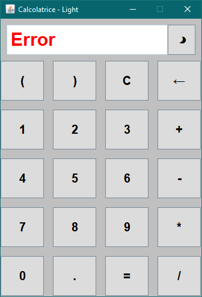

# 🧮 Calculator_JAVA (Java Swing)

Applicazione desktop per una calcolatrice matematica sviluppata in **Java 17+** con interfaccia grafica **Swing** e supporto all'input da tastiera, gestione temi (Chiaro/Scuro) ed elaborazione di espressioni matematiche complesse tramite un parser a discesa ricorsiva (**Recursive Descent Parser**) realizzato appositamente e facilmente estendibile.

A differenza delle calcolatrici semplici che eseguono le operazioni in sequenza immediata, questo software valuta l'intera stringa inserita rispettando le precedenze algebriche (parentesi, moltiplicazioni/divisioni e somme/sottrazioni), inoltre gestisce la sintassi per la moltiplicazione implicita.

---

## ✨ Caratteristiche 

* **Interfaccia Grafica (GUI) Swing:**
    Layout pulito a griglia (5x4) con display dedicato e pulsante dedicato per il cambio tema.

* **Tema Dinamico Dark/Light:**
    Cambio di tema istantaneo in runtime con aggiornamento dell'albero dei componenti (`SwingUtilities.updateComponentTreeUI`).

* **Gestione Centralizzata degli Errori:** 
    Sistema di diagnostica personalizzato (`MyErrorManager`) per la gestione e segnalazione tramite popup puntuale degli errori (divisione per zero, parentesi non bilanciate, sintassi o numeri non validi).

* **Recursive Descent Math Engine:**
    Valutazione di espressioni matematiche tramite analisi sintattica, senza l'uso di librerie esterne, basata su grammatica formale (in modo da avere una gestione nativa della precedenza degli operatori, parentesi annidate e numeri decimali).
* **Moltiplicazione Implicita:**
    Riconoscimento automatico del prodotto sottinteso, ad esempio `5(2+3)` o `2.5(4)`.

* **Global Key Bindings:**
    Mappatura dell'input da tastiera tramite `InputMap` e `ActionMap` a livello di `JRootPane`, garantendo la cattura dei tasti (compresi tasti Invio per il calcolo ed Elimina/Backspace per cancellare l'ultimo carattere) indipendentemente dal focus dei componenti.

* **Estendibilità del Parser:**
    La classe base `StringParser` astra le dinamiche di lettura del testo, rendendo `ExpressionParser` facilmente estendibile per supportare funzioni matematiche aggiuntive (es. radici, potenze, funzioni trigonometriche).

* **UI Clean & Responsive:**
    Formattazione intelligente dei risultati (azzeramento dei decimali superflui) e layout intuitivo.

---

## 📐 Architettura del Parser (Grammatica LL)

Il motore matematico `MathEngine` delega l'analisi alla classe `ExpressionParser` (estensione di `StringParser`), che valuta la stringa in un singolo passaggio senza librerie esterne. L'analisi rispetta la seguente grammatica formale:

```text
expression = term (('+' | '-') term)*
term       = factor (('*' | '/') factor)*
factor     = ('+' | '-') factor | '(' expression ')' | number

```

## 🛠️ Tech Stack & Requisiti
|||
|--:|:--|
| **Linguaggio:** | Java SE 17+ |
| **GUI Framework:** | Java Swing (Event-Driven Architecture) |
| **Dipendenze:** | Nessuna libreria esterna (100% Native Java) |

---

## 🗂️ Struttura del Progetto

Il progetto segue una struttura modulare e orientata agli oggetti con separazione delle responsabilità:

```text
Calculator_JAVA/
└──📂 Calcolatrice_Java/
    ├──📑 Main.java                         # Punto di ingresso (Main class) dell'applicazione
    └──📁 src/
        └──📦 calculator/                   # Package principale
            ├──📜 CalcolatriceGUI.java      # Interfaccia grafica Swing, gestione eventi e Temi
            ├──📜 MathEngine.java           # Entry-point per la valutazione delle espressioni
            ├──📜 ExpressionParser.java     # Parser matematico (Grammatica: Expression, Term, Factor)
            ├──📜 StringParser.java         # Parser di basso livello per lo scorrimento dei caratteri
            └──📜 MyErrorManager.java       # Gestione centralizzata dei messaggi d'errore
```

---

## 🚀 Come Compilare ed Eseguire

```bash
# Compilazione
cd [Your_Path]/Calcolatrice_Java
javac -d bin src/calculator/*.java Main.java

# Esecuzione
java -cp bin Main
```
---
## ✂️ Screenshot
### Temi



### Errori



---
