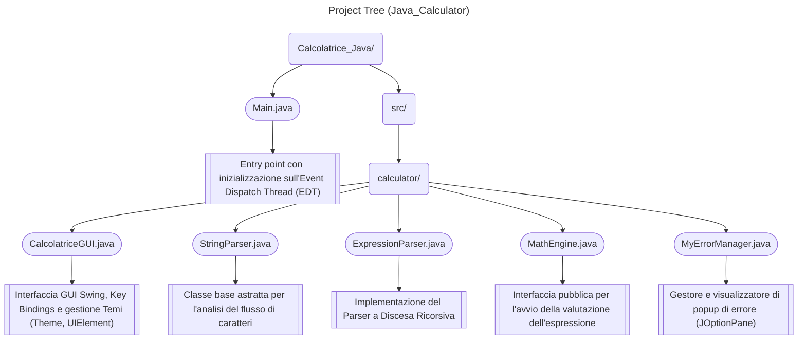

# 🧮 Calculator_JAVA (Java Swing)

Applicazione desktop per una calcolatrice matematica sviluppata in **Java 17+** con interfaccia grafica **Swing**.
Il progetto include un Parser a Discesa Ricorsiva (**Recursive Descent Parser**) scritto da zero per la valutazione immediata di espressioni matematiche complesse, supporto input da tastiera, moltiplicazione implicita e passaggio dinamico tra temi (Dark / Light).

Realizzato con l'idea di scalabilità e manutenibilità.

| Possibilità di aggiungere | Descrizione Procedura|
|:---|:---|
| Errori | Su MyErrorManager inserire uno `static final int CONST_NAME` unico e nella funzione showErr il relativo `case CONST_NAME -> "Put your message here";`.|
| Temi | Momentaneamente è presente `class Theme` su calcolatriceGUI.java che presenta un booleano `darkMode` e le funzioni `toggleTheme`, `isDark`, `get` e due ulteriori funzioni `dark` e `light`. Per cambiare uno dei temi è sufficiente modificarne la relativa funzione. Per aggiungerne si consiglia di cambiare `darkMode` da bool ad int, introdurre un nuovo `private static int themeNum` che contenga il numero totale di temi presenti, variare `toggleTheme` in modo che incrementi `darkMode` nei limiti di `themeNum`, infine usare `get` come switch per restituire il tema corretto in base al valore assunto da `darkMode`. Con tali modifiche basterà aumentare `themeNum` ed inserire un ulteriore case su `get` per aggiungere tutti i temi che si desidera. Nota: variare anche l'icona del pulsante |
| Pulsanti e Funzioni | Aggiungendo il simbolo a KMAP quasi tutto il lavoro è già svolto, per una migliore visualizzazione si consiglia di variare la disposizione attuale, modificando di conseguenza i valori `KMAP_ROWS` e `KMAP_COLS`, l'input da tastiera viene abilitato, se si desidera un comportamento diverso o che un ulteriore input ne attivi il comportamento va aggiunta manualmente (guardare come premendo `enter` si attiva `=`), infine, se necessario, aggiungere la regola al parser. |

---

## ✨ Caratteristiche Principali

* **Recursive Descent Math Engine:** Valutazione di espressioni matematiche tramite analisi sintattica basata su grammatica formale (in modo da avere una gestione nativa della precedenza degli operatori, parentesi annidate e numeri decimali).
* **Moltiplicazione Implicita:** Riconoscimento automatico del prodotto sottinteso, ad esempio `5(2+3)` o `2.5(4)`.
* **Global Key Bindings:** Mappatura dell'input da tastiera tramite `InputMap` e `ActionMap` a livello di `JRootPane`, garantendo la cattura dei tasti indipendentemente dal focus dei componenti.
* **Tema Dinamico Dark/Light:** Cambio di tema istantaneo in runtime con aggiornamento dell'albero dei componenti (`SwingUtilities.updateComponentTreeUI`).
* **Gestione Centralizzata degli Errori:** Sistema di diagnostica personalizzato (`MyErrorManager`) per la gestione e segnalazione puntuale degli errori (divisione per zero, parentesi non bilanciate, sintassi o numeri non validi).
* **UI Clean & Responsive:** Formattazione intelligente dei risultati (azzeramento dei decimali superflui) e layout intuitivo.

---

## 📐 Architettura del Parser (Grammatica LL)

Il motore matematico `MathEngine` delega l'analisi alla classe `ExpressionParser` (estensione di `StringParser`), che valuta la stringa in un singolo passaggio senza librerie esterne. L'analisi rispetta la seguente grammatica formale:

```text
expression = term (('+' | '-') term)*
term       = factor (('*' | '/') factor)*
factor     = ('+' | '-') factor | '(' expression ')' | number

```

## 🛠️ Tech Stack & Requisiti

* **Linguaggio:** Java SE 17+
* **GUI Framework:** Java Swing (Event-Driven Architecture)
* **Dipendenze:** Nessuna libreria esterna (100% Native Java)

---

## 🗂️ Struttura del Progetto

Il progetto segue una struttura modulare e orientata agli oggetti con separazione delle responsabilità:



```text
Calcolatrice_Java/
│
├── Main.java                      # Entry point principale con inizializzazione sull'Event Dispatch Thread (EDT)
└── src/
    └── calculator/
        ├── CalcolatriceGUI.java   # Interfaccia GUI Swing, Key Bindings e gestione Temi (Theme, UIElement)
        ├── StringParser.java      # Classe base astratta per l'analisi del flusso di caratteri
        ├── ExpressionParser.java  # Implementazione del Parser a Discesa Ricorsiva
        ├── MathEngine.java        # Interfaccia pubblica per l'avvio della valutazione dell'espressione
        └── MyErrorManager.java    # Gestore e visualizzatore di popup di errore (JOptionPane)
```
